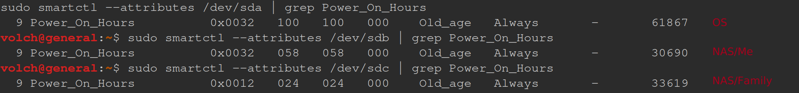

Zdravím. Přezdívám se Volčar a jsem z Česka 🇨🇿.

Jsem fanatik do Linuxu, který se rád zabývá vším, kde proudí elektrony.

Zoomer/INTJ

---

## 📦 Zkušenosti

- `Angličtina` - C1, konzumuji média v angličitně, dělám projekty v angličtině atp.
- `Linux` – používám deně, homelabbing, experimentování na RISC64V 
- `Docker & docker-compose` – multi-container orchestrace
    - `Rhasspy` / `Home Assistant` / `Nextcloud` – self-hosting
- `C#`, `zájem o C++/Rust`, `Bash` – programování a lepení programů
- `3D modeling` – TinkerCAD / FreeCAD / Blender | Technické i kreativní
- `Základy síťařiny` – static IP, trošku IOS (cisco packet tracer)
- `Účast v celorepublikové soutěži FET` v ČVUT, a to FET ani není můj obor, takže i když jsem nevyhrál, tak je ta účast je víc než dost. 

Junior ve všem a rád se přiučím něčeho nového! 

---

## 💻 Linux Desktop

- OS: LMDE (Linux Mint Debian Edition)
- Upravený dle mé libosti (PipeWire audio, Cinnamon DE, Cinnamon applets, atp.)
- Měl jsem tu čest s:
  - `ALSA`, `PipeWire`, `journalctl`, `udev`, `systemd`, `/proc/`
  - GPU troubleshooting (NVIDIA & nouveau, tyhle dva názvy asi vše vysvětlují)
  - Sestavování SW ze zdroje & sem a tam i patching 

### PC 

*Fastfetch z 24.4.2025*

---

## ⚙️ Můj server "Generál"

- 🏠 **Domácí server** (LMDE / Debian)
  - Kontejnerizované
    - `Home Assistant` – lokální Zigbee/MQTT
    - `Rhasspy` – Česky mluvící voice assistant s lokálním "wake word" & Home Assistant intents
    - `OpenTTS` – FOSS text-to-speech
    - `Nextcloud` – Sdílení úkolů a souborů mezi PC a Androidem
    - ~~`MiniDLNA` + `Samba` – Síťové sdílení souborů~~
    - `Jellyfin` + `Samba` - HW akcelerovaná videotéka s NASkou
  - PipeWire + ALSA audio stack pro směrování a přepojování mikrofonu a repráků
  - Wake-on-LAN, headless management, a CLI nástroje pro vzdálenou správu

### Server "Generál"

Teď tam má GTX 1650 pro HW akceleraci pro moji videotéku.

*Fastfetch z 24.4.2025*

### Pan Generál

K tomuto "serveru" se váže zajímavý příběh. Je to starý počítač z bazaru za necelých 1 100,- kč [44~€] od někoho z Prahy, konkrétně od někoho, kdo se jmenoval "Petr Pavel". Bylo to ještě před volbami prezidenta. Následně při začátku voleb a tomto zjištění, jsem tento server pojmenoval "Generál", v praxi "General". Je to *asi* počítač od PREZIDENTA, Generála Petra Pavla, ale jestli že ne, tak je to "general", čili obecný server. Krásné to jméno!

Tomu není vše. V 2022 se svět stále nějak snažil vzpamatovat z covidu, a zejména my ajťáci z cen PC komponentů. Čili tenhle server není 2x tak nový. [Ne]vtipné body:
- `Je to DDR2` [max 4GB se správným CPU)
- `dGPU*`  údajně používá "mobile" - notebookovou verzi chipu.
- `dGPU*` je údajně tak zajmavá grafika, že Kernel hází errory ohledně chybějících binárek. AMD GPU driver problémy na linuxu? Librélandie padla...
- `CPU**` chladič má mrtvý větráček [klasická věžička, takže to je chlazené pasivně]
- `Nejmladšímu disku jsou 3 roky` (DiskA & B 30k H, OS 61k H).. a používám to jako NASku – 24/7,

**[před upgradem na GTX1650]*
** Už žije ;)

Takže jestli tohle není ten nejvíce nervy drásající server, který jste kdy viděli, tak ho muselo maximálně trumpfnout server ze stránek OpenBSD.
Jelikož se stále ve světě PC komponent stále něco dějě [v době psaní jsou drahé ramky (5x násobně) a disky], tak mám v plánu upgradevoat můj PC, a předědit komponenty z PC na Generála.

---
## Nejambicioznější projekt: Voice Assistant "Nargon"
*"To jsem zase já, Nargon"*

*Dle jednoho českého MC youtubera*

- Vyrobil jsem si **kompletně offline Česky mluvícího asistenta** kterému říkám **Nargon\***:
    - Běží 24/7
    - Wake-word triggered (skrze Rhasspy + porcupine*)
    - Mluví přes OpenTTS
    - Odpovídá čas/počasí, ovládá světlo a Home Asistenta skrze intenty
    - Mám v plánu ho integrovat s **Ollama** (lokální LLMko), aby mi mohl odpovídat na moje dotazy

Moje vlastní Alexa!

---

### Čemu se věnuji?

Rád se učím:
- Embedded Linux - Yocto, Buildroot, etc. --- Koukněte na můj blog ohledně RISC64 Linux PC VisionFive V2!
- Chytrá domácnost - Zigbee, MQTT, detekce pohybu, vlastní meteologická stanice
- Linux projekty na Raspberry Pi - RC Wi-Fi autíčko/dron
- PCVR Linux - Stávající (15.3.2026) situaci samostatně zlepšil Valve s Frameworkem!
- Meshtastic - Možná sem hodím kontakt na mě. 

---

## Sociální sítě

### Printables
Mrkněte na moje [3D modely](https://www.printables.com/@Volchar_3151848)!

### Github
Mrkněte na můj [github](https://github.com/Volchar-CZ)!

## Kontakt (?)

Teď se asi budu ten divný já.. :D

Kvůli boomu AI a všerůzných data scraperů neposkytuji **(zatím)** žádný kontakt. Tuto stránku **(zatím)** posílám jako link a papá, čili to znamená, že jsme již v kontaktu. Mám v plánu sem přidat nějaký kontkat pro potencionální spolupráci/nabídky.

Pokud **vermomocně potřebujete se mnou navázat kontakt**... tak si udělejte printables účet, jelikož tam nejdou vypnout soukromé zprávy.. ups. Takhle vím, že jste se obětovali a vytvořili jste si účet někde, kde ho ani pomalu na nic jiného nepoužijete a hlavně si myslím, že BOTi nebudou až tak sofistikovaný, aby tohle dokázali... 