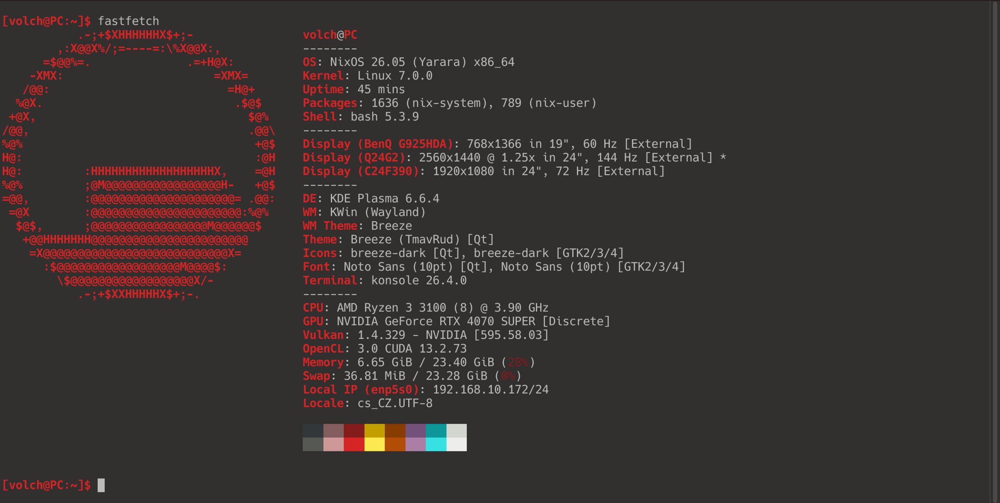
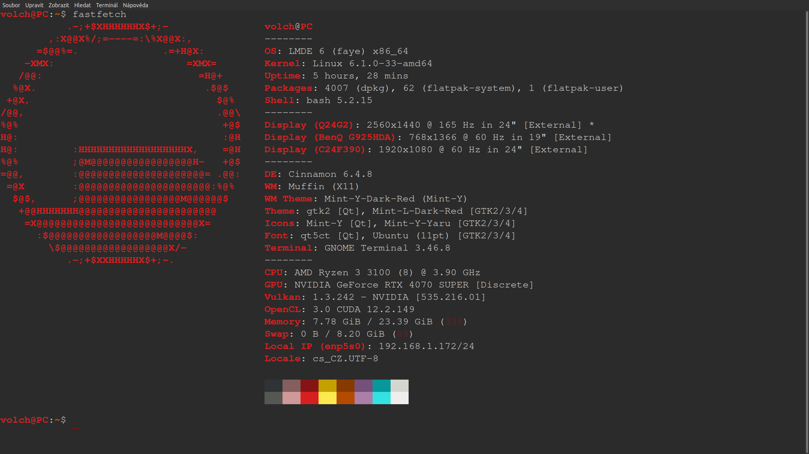
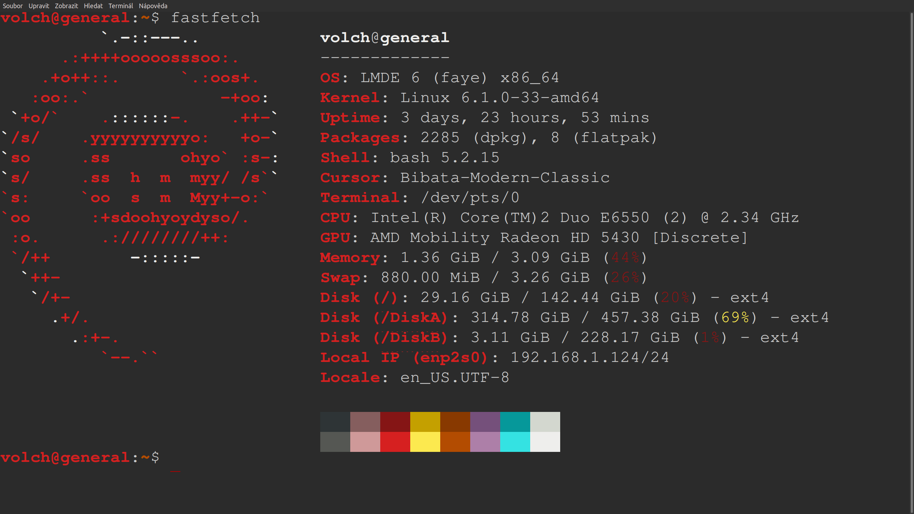

+++
title = "About me"
description = "what I do"
type = "about"
tags = [
    "My information",
]
toc = false
date = "2026-03-20T10:00:00+02:00"
categories = []
series = []
[ author ]
name = "Volchar"
+++
Hi! I'm Volchar and I'm from Czechia 🇨🇿. 

I focus on system administration, automation, and solving technical problems, often tying everything together through scripting or complementing existing solutions with my own applications.  
In my free time, I enjoy learning new things, whether they relate to my field of work or not.

In short, I'm fanatic into Linux and I like everything that has angry pixies running through it.

Zoomer/INTJ-T

---

## Skills & Tools

- `English` - C1, I consume media in english, I do projects in english etc.
- `Linux` – daily usage, homelabbing, experimentation on RISC64V 
- `Docker & docker-compose` – multi-container orchestration
    - `Rhasspy` / `Home Assistant` / `Nextcloud` – self-hosting
- `C#`, `interest in C++/Rust`, `Bash` – coding and app glue
- `3D modeling` – TinkerCAD / FreeCAD / Blender | Technical and creative wise
- `Networking` – static IPs, little bit of IOS (cisco)
- `Participation in the nationwide FEL competition` at the Czech Technical University in Prague.. and FEL isn't even my field of study, so even though I didn't win, just being there was more than enough. 

Junior in everything and I like to learn new things!

## Linux Desktop

- Current daily driver: NixOS
- Themed & tuned (PipeWire audio, Flakes, Widgets, etc.)
- Had the chance to meet with:
  - `ALSA`, `PipeWire`, `journalctl`, `udev`, `systemd`, `/proc/`
  - GPU troubleshooting (NVIDIA & nouveau woes included)
  - DIY software builds & patching from source

### PC
## Current

*Fastfetch taken on 29.4.2026*  

## Previous

*Fastfetch taken on 24.4.2025*
*Yes, I've missed the new fastfetch pic by 5 days..*  

---

## My server "Generál"

- **Home Server** (LMDE / Debian)
  - Dockerized:
    - `Home Assistant` – local Zigbee/MQTT
    - `Rhasspy` – Czech-speaking voice assistant w/ local wake word & intents
    - `OpenTTS` – FOSS text-to-speech
    - `Nextcloud` – Synced tasks and file sharing between PC and Android
    - ~~`MiniDLNA` + `Samba` – Network file/media sharing~~
    - `Jellyfin` + `Samba` - HW acelerated movie collection and NAS
  - PipeWire + ALSA audio stack routing inside containers (mic/speaker passthrough)
  - Wake-on-LAN, headless management, and CLI remote tools

*I'll make standalone article some day in the future!*

### Server "Generál"

*Fastfetch taken on 24.4.2025*

There’s an interesting story behind this “server”. It’s an old computer I bought at a secondhand shop for just under 1,100 CZK [~44€] from someone in Prague, specifically from someone named “Petr Pavel”. This was before the presidential election. Then, as the election began and I realized this, I named the server “Generál,” or “General”. It’s *probably* a computer from the PRESIDENT, General Petr Pavel, but if not, then it’s a “general” server as in general-purpose one. What a beautiful name!

That’s not all. In 2022, the world was still somehow trying to recover from COVID, and especially us IT folks from the prices of PC components. So this server isn’t exactly brand-new. [Un]funny points:
- `It’s DDR2` [max 4GB with the right CPU]
- `The dGPU*` supposedly uses a “mobile”, laptop-esk version of the chip.
- `The dGPU*` is apparently such a weird graphics card that the kernel throws errors about missing binaries. AMD GPU driver issues on Linux? Libreland has fallen...
- `The CPU**` cooler has a dead fan [classic tower cooler, so it’s passively cooled]
- `The youngest drive is 3 years old` (Drive A & B 30k hours, OS 61k hours)... and I use it as a NAS – 24/7,

**[before upgrading to GTX1650]*

** It’s working again ;)

So if this isn’t the most nerve-wracking server you’ve ever seen, then the only thing that could possibly top it is the server on the OpenBSD website.
Since things are always changing in the world of PC components [at the time of writing, RAM and hard drives are expensive (5x the usual price)], I plan to upgrade my PC and transfer the components from my PC to the General.

---
## Most Ambitious Project: Voice Assistant "Nargon"
*"To jsem zase já, Nargon"*

*In tribute to a Czech MC YouTuber*

- I built a **completely offline Czech-speaking assistant** that I call **Nargon**:
    - Runs 24/7
    - Wakeup-word triggered (via Rhasspy + Porcupine*)
    - Speaks via OpenTTS
    - Answers time/weather queries, controls lights and Home Assistant via intents
    - I plan to integrate it with **Ollama** (a local LLM) so it can answer my questions

My very own Alexa!

---

### What’s Next?

I enjoy learning about:
- Embedded Linux - Yocto, Buildroot, etc. --- Check out my blog post on the RISC64 Linux PC VisionFive V2!
- Smart home - Zigbee, MQTT, motion detection, custom weather station
- Linux projects on Raspberry Pi - RC Wi-Fi car/drone
- PCVR Linux - Valve has independently improved the current (March 15, 2026) situation with the Framework!
- Meshtastic - I might post my contact info here. 

---

## Social Media

### Printables
Check out my [3D models](https://www.printables.com/@Volchar_3151848)!

### GitHub
Check out my [GitHub](https://github.com/Volchar-CZ)!

## Contact

I guess I’ll be the weird one now... :D

Due to the AI boom and all sorts of data scrapers, I’m not providing any contact info **(yet)**. I’m **(for now)** just sharing this page as a link and that’s it, which means we’re already in contact if you're reading this. I plan to add some contact info here for potential collaborations/offers.

If you **absolutely need to get in touch with me**... then create a Printables account, since you can’t turn off private messages there... oops. That way I’ll know you went out of your way to create an account on a website which you’ll hardly ever use for anything else, and most importantly, I don’t think bots are sophisticated enough to pull this off... 