+++
title = "OPNSense firewall"
description = "\"Only the paranoid survive\" - Harold Finch (Person of interests)"
type = "posts"
tags = [
    "Linux",
    "Interests",
    "Sysadmin",
    "Portfolio",
]
toc = true
date = "2026-04-16T22:00:00+02:00"
categories = [
    "Homelab",
    "OPNSense",
    "Portfolio",
]
series = []
[ author ]
  name = "Volchar"
+++

## Why

I often start by writing ***Why***. Even though this is one of those projects with a practical use, looking back, I can’t justify it any other way than by saying “it’s cool.” It’s a strange feeling.

From a technical perspective:

 - Deepening my knowledge of OPNSense, networking, and OpenBSD
 - Stepping out of my comfort zone into the unknown
 - You could say I’m deploying an “enterprise” solution in my home network/homelab
 - Real protection for my network (Suricata IDS)

Despite these compelling arguments, I still don’t see the rational and pragmatic “why.” 

Here’s the thing. The main reason I decided to set up a firewall in the first place is that I want to route a VPN from my VPS to my home server. Since I’m opening a path into my internal network, I’m also exposing myself to risks. Just how seriously I take my privacy and security was already evident in my post where I show how I [secure my VPS](../myVPS/index.cs.md). 

**My assumption** is that a firewall, which will orchestrate this system using **Suricata** and **Pi-hole with known threat lists**, will serve as another barrier for a potential attacker.

 - If I were to compare this level of network security (*from the internet to my server*) to a degree of destruction:

    1. For a startup that doesn’t take security lightly?  
    **1 or 3 rounds from a 152mm tank howitzer, whichever the reader prefers.**
	2. For a Linux fanatic who blocks ports on their VPS via UFW anyway and plans to host only game servers, if any?  
    **Swapping the mass of a proton with that of an electron.** What kind of havoc would that wreak? I don’t know.

That’s exactly what I’m trying to describe here. It’s like using a jet fighter engine as a grill. For personal use, that’s more than enough.  
On the other hand, **it gave me valuable experience**, **control over my network**, and as I’m writing above, it’s **another barrier for potential cyberscumbags**.  

That's the reason why I’m running this whole project under the motto:

> *“Only the paranoid survive” – Harold Finch (Person of Interest)*

The real reason I invested in this project was that I’m simply fascinated by these things.  
Yes, it really isn’t any more noble than that ;)

## Hardware
### PC
This is the **HP Thin Client T630**. I bought it on Bazoš for 800 CZK [~33 EUR]. 

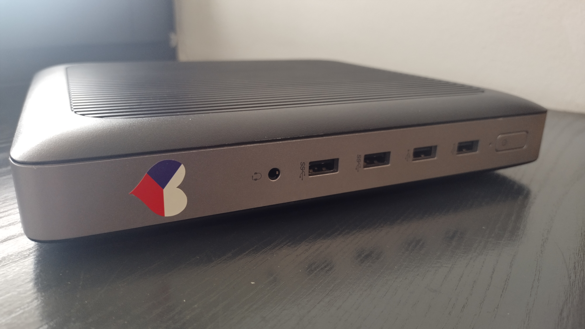

And right away, we run into the first supposed snag.

The seller had an ad for a **T620**, which is an older, slower, and especially **NARROWER** model with a **DIFFERENT** internal interface. But I received a **T630**, which is a newer (by 3 years), faster (4-core), and slightly **WIDER** model with a **DIFFERENT** internal interface.

I bought the computer before Easter [**April 2, 2026**], and I agreed with the seller that he would send it to me via Zásilkovna. Those poor guys work even during the holidays, since I already had the computer here by Saturday, but let’s get to that later…

To make the most of my time, I immediately bought a PCIe-Mini->RJ45 adapter on Allegro that same day, since the advertised model only has one Ethernet port.

But on Saturday, I was wiser.

 - T620: Has PCIe-Mini
 - T630: Has M.2, specifically 3 slots (one had an Intel WiFi NIC, 2 for drives)

 And I bought a PCIe-Mini to RJ45 adapter...

After a quick return, I immediately ordered an M.2 to RJ45 adapter, but unfortunately it took them quite a while...

Since I was smart enough to use my free time to buy a PCIe-Mini adapter, I decided to use the T630 as a test platform for my potential switch. *Potential future post?!*

#### PC Specifications

\+A little preview of what I'll be doing next...
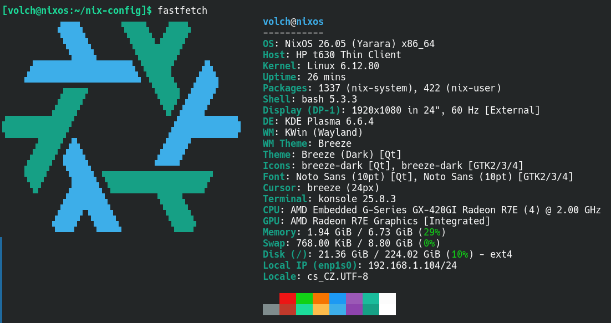

Since I was testing NixOS (on a separate drive), it didn’t even occur to me to run benchmarks or other fancy little tests. 

After the update and explicitly switching the driver to ‘amdgpu’, the computer handled regular web browsing just fine.

FHD videos in full screen, however, were a bit of a struggle. Personally, I think it was because it had to "power up" the 2K monitor. Then I lowered the resolution to FHD, but I didn't try any more videos. I suspect that 'h264ify' might help.
___

#### Installing the Second Interface

**T630** models came in several configurations, and mine was the "Wi-Fi NIC" configuration. This means I had another Intel Wi-Fi NIC in the rear M.2 slot, which is taking up space. Not to mention the premade slot for an expansion card. From what I’ve seen online, you can have VGA, Ethernet, etc.

***Poor photo quality so I could blur NIC details***
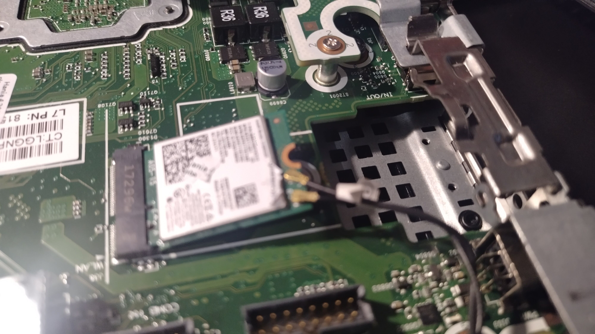

That 16-pin connector right below the M.2 slot is labeled 'VGA'. I’m guessing that’s the port they’d use in a configuration with a VGA port.

I’d also like to give HP some credit. I’m not a fan of non-modular computers in a PC role. 

**!A PC MUST BE MODULAR FOR REPAIRABILITY!**

That’s my opinion...  
But this particular model not only has replaceable RAM but also  storage (see the mention of the additional 2 M.2 slots) in a non-desktop computer that also features tool-less opening and replacement of SSDs and RAM. Awesome design. 

Yes, the APU *(CPU+iGPU)*, power supply, and motherboard are all in one, so if any of those fail, the whole computer goes down. My argument is that in this case it makes sense, since thin client computers are supposed to be economical in terms of both size and performance/power consumption. If I wanted modularity, I’d have to go with overpriced ITX motherboards and cases.  
If that rule of mine would be THAT dogmatic, I wouldn't even be able to use a Raspberry Pi. 

If it were a computer the size of a standard desktop with proprietary hardware components (e.g., Dell computers), I'd be complaining.

**BACK TO OPNSENSE**

I unscrewed the NIC and replaced it with an RTL Ethernet port. RTL - Realtek is a pretty crucial detail, since OpenBSD and Realtek don’t get along very well.

Before ordering this adapter, I checked online to see if the port I’d chosen would work.

```BASH
:~$ pciconf -lv
    class      = network
    subclass   = ethernet
re1@pci0:2:0:0:	class=XX rev=XX hdr=XX vendor=0x10ec device=XX subvendor=0x10ec subdevice=XX
    vendor     = 'Realtek Semiconductor Co., Ltd.'
    device     = 'RTL8111/8168/8211/8411 PCI Express Gigabit Ethernet Controller'
```
Since this is some no-name brand, here’s a pciconf output, if you want to replicate my process. Don’t do it ;)

Next, I screwed the RJ45 port itself into the chassis. I had to bend it a little with some metal pliers, but it fit in as if it had been made for that spot.

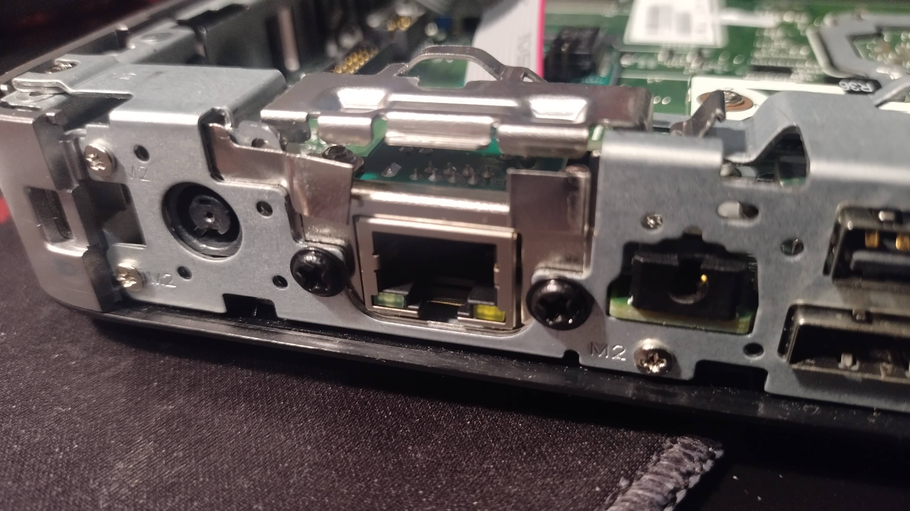

## Software
### OPNSense
OPNSense is a more open-source variant of **pfSense**.  
As I wrote in [why](#why), I didn’t have many reasons for the firewall, let alone for choosing a specific OS.

I liked the idea of a more open ecosystem that is developed in Europe. In terms of features, which I still have to learn, I think both options would suffice for my needs.

#### Installation
Overall, it went smoothly, but I did have one "interesting" moment.

When I first installed ONSense, I accidentally left the USB drive in the computer, and after rebooting, the system booted from it. I didn't realize this, but I thought it was strange that the password I had set for **root** wasn't working. After realizing the flash drive was still there, I unplugged it, and then none of the passwords worked. Since I didn’t want to troubleshoot the issue, I just reinstalled it.

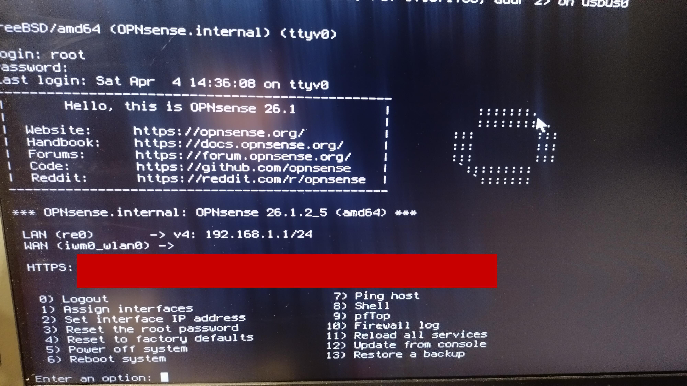

After that, all I had to do was wait for the adapter. Thanks to the magic of blogs, let’s fast-forward to the future.

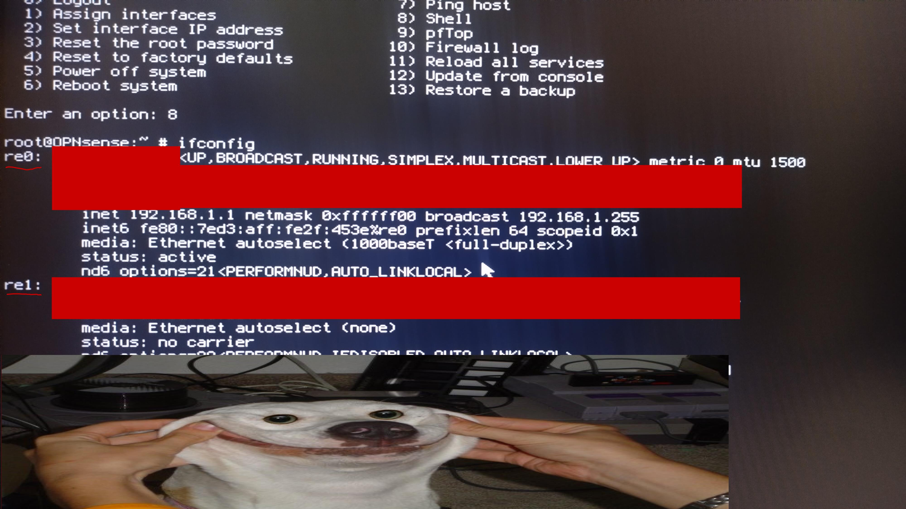

After the wonderful discovery that Realtek gets along with OpenBSD, I could finally dive into the configuration.

#### Setup
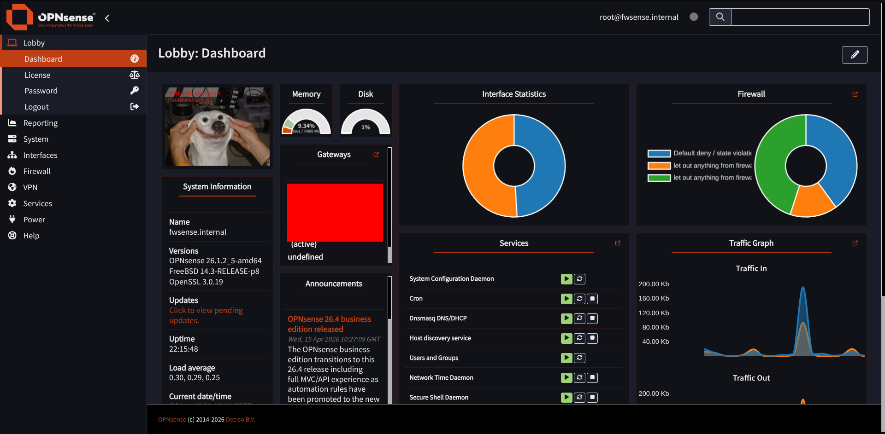
First, I had to set up an internet connection, which meant:

 1. Create/configure a DHCP server
    1. Configure the interfaces - re0 and re1  
    Distinguish between the WAN and LAN.
    2. Configure my network’s IP range (something other than 1.x)  
    To avoid conflicting with the Wi-Fi’s IP range.

 2. Configure DNS
    1. Set the IP addresses of allowed DNS resolvers  
    So I can resolve google.com to 142.251.209.14.
    2. Ensure that my computer and server can retrieve DNS settings from the firewall  
    So I don’t have a “it was DNS” problem.

##### LAN
This was straightforward in the GUI. All I really had to do was set a different range than the one my Wi-Fi uses.

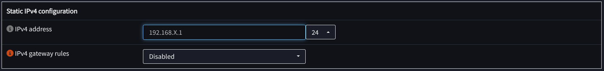

And then the DHCP itself. Due to my **lack** of knowledge about OPNSense and its services, I decided to go with the "default" solution, namely "Dnsmasq DNS & DHCP." There are other services here that perform the same functions.

##### WAN
The WAN took a bit of work, and again, because of something trivial.

For the life of me, I couldn’t get the port to “turn on.” By that I mean I had ‘```status: no carrier```’. No matter what I did in the GUI or in the console via SSH, **NOTHING HELPED**.

I’ll be honest, I used AI here because I was at a loss. The AI told me that, based on all my tests, it was 99% chance it's a DOA (dead on arrival) adapter. The truth is, I had nowhere else to test it, since I don’t have an M.2 slot this easily accessible anywhere else. I didn’t want to believe it. So I **powered it off**, took it apart, and thoroughly checked every single pin on the cable connecting the M.2 motherboard to the RJ45 daughterboard with a multimeter. Everything looked okay. So I reconnected everything and tried to **turn it on**, and voilà... **```status: active```**.

What do I see highlighted? **powered it off** and **turn it on**? Or rather... ***!? restart?!***

Our teacher L. M. in EaA, Electrical Engineering and Automation, used to say that first we have to say **A**, and then we can talk about **B**.

I should have thought of that sooner, especially since Realtek is notoriously finicky on OpenBSD.  
An "IT Crowd" sketch... please!

Since my firewll is behind the "Wi-Fi" (why hasn't anyone come up with a better name for an ISP-provided router/AP/modem combo yet?), I just unchecked ```Block private networks```.

Then I just set static IP address for my server.

Realistically, I had the basics done. Now DNS!

##### DNS
I use the following order:

 1. my Pi-hole instance
 2. 1.1.1.1 # Cloudflare
 3. 8.8.8.8 # Google

Pi-hole itself has the same configuration (of course, without a reference to itself).

Specifically, I have lists from **osid.nl** and **Steven Black**.

In the OPNSense GUI, DNS configuration is very intuitive... or rather, not at all :D

I thought that, since DNS is usually set via the DHCP server, there would be a setting somewhere to add a list of DNS resolvers. Unfortunately, in OPNSense, it’s set under '*System->Settings->General*'. How intuitive!

First, I set up Pi-hole there. Then, in case of an outage, for example: if I’m working on [General](../../about/index.cs.md#server-generál), I added Cloudflare and Google DNS for redundancy.

And it works great


On my computer, I just had to check the **DNS** section ```automatically```. General took care of it on its own, without any help.

### Suricata
Suricata is a **FOSS IDS** system that comes pre-installed with OPNSense. It's actually the whole reason I wanted a firewall in the first place. So far, I've just been going through the settings for features I've had for a long time.

#### Settings
First, I downloaded a few rules from 'ET open', specifically:  
emerging-  
 attack_response  
 malware  
 misc  
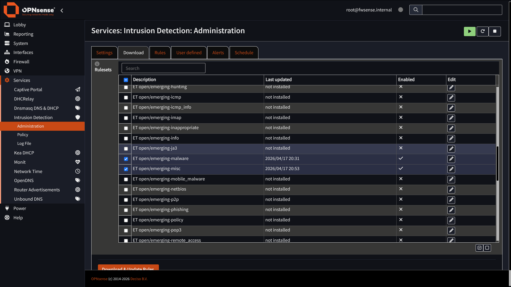

I didn’t have any specific requirements. I just wanted “malware” because… well… it just makes sense that I don’t want that… and then “attack_response” because it contains a test rule that lets me verify that Suricata is working properly.

Then I just enabled “detection mode”.
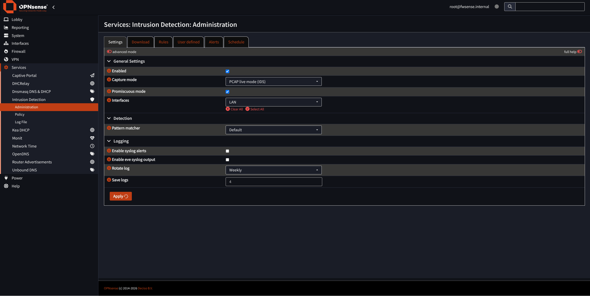
and checked ```Enabled```.

I ran this command on my computer:
```BASH
curl http://testmynids.org/uid/index.html
```

And again...

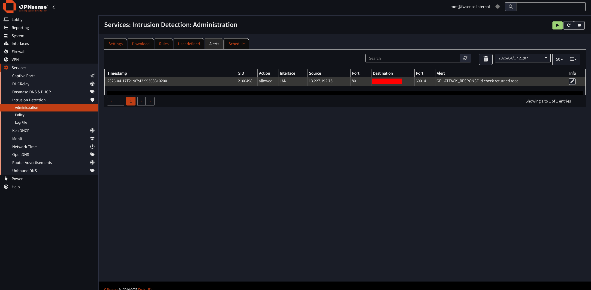

As of today [**April 19, 2026**], I haven’t seen any false or real threat detections, so as of today I’ve enabled blocking.

*This rule only alerts, but I’ve configured it to block*
