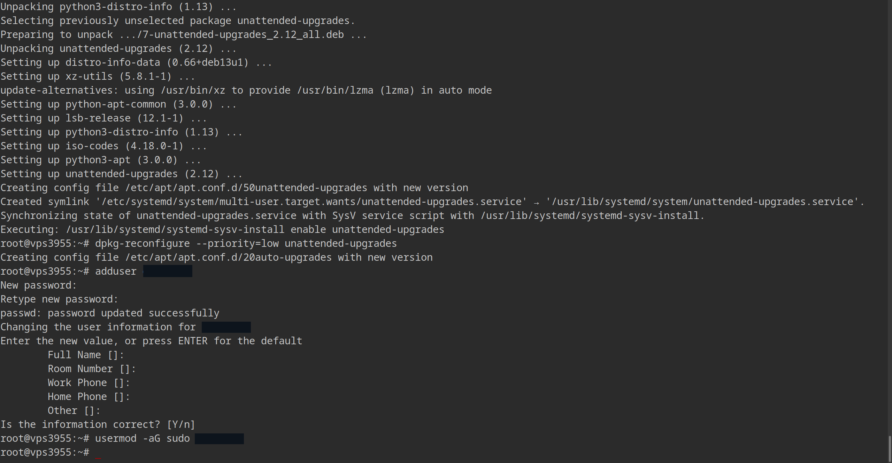
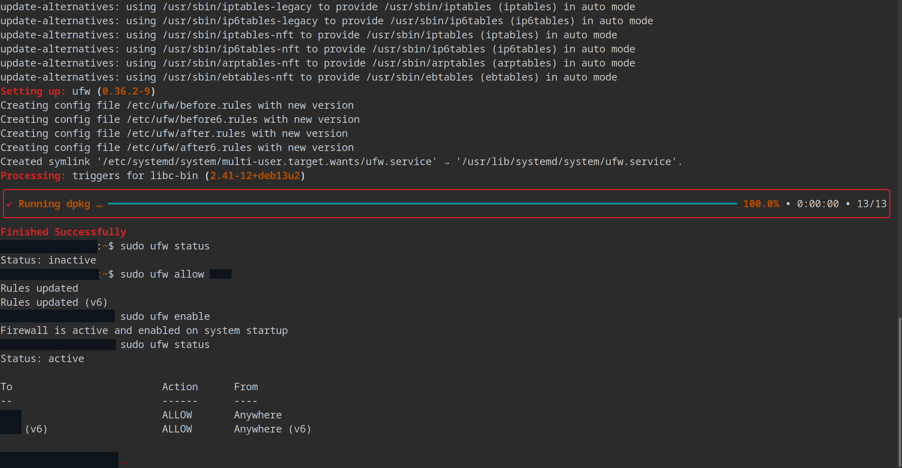
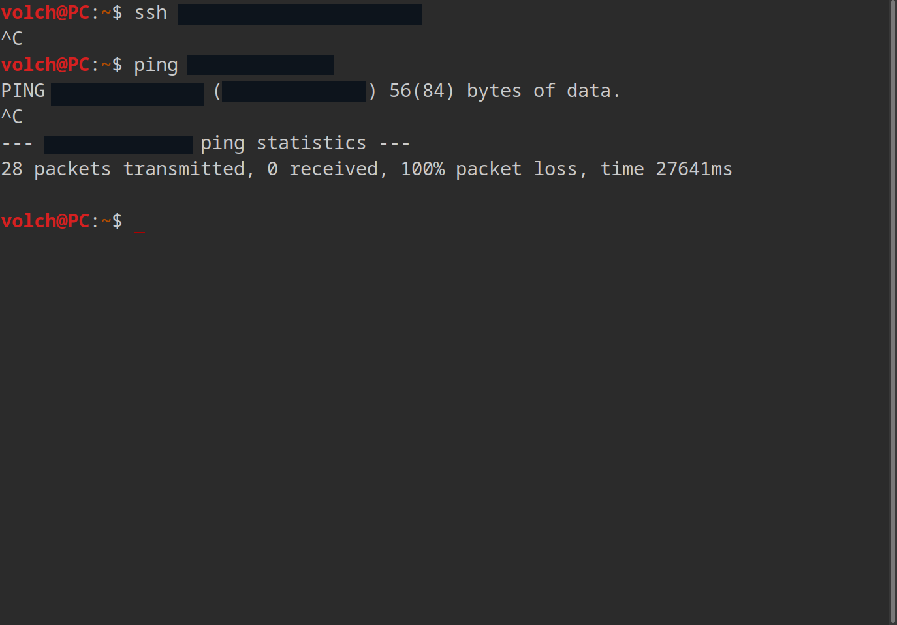

+++
title = "Zavedení a zpevnění zabezpečení mé VPSky"
description = "Jak jsem si zabezpečil VPSku"
type = "posts"
tags = [
    "Linux",
    "Interests",
    "Sysadmin",
]
toc = true
date = "2026-03-20T10:00:00+02:00"
categories = [
    "Homelab",
    "VPS",
]
series = []
[ author ]
  name = "Volchar"
+++
Už dlouho jsem si hrál s myšlenkou, že bych si pořídil VPSko pro hostování serverů [mumble atp.] či rychlé počudlání něco u mě doma jsem někde pryč, ale zejména pro obcházení NATky poskytovatele internetu. Tenhle problém mě už pronásleduje od dětství, kdy jsem si chtěl vytvořit minecraft server a hrát s kamarády, ale vždy přítomný "port fowarding" byl kamenem úrazu jakýkoliv mých snah.

## Proč
Rád vždy začínám, proč vůbec tyhle věci dělám. Tady je to jasné, hlavním cílem je de facto proxy, prostě obejít NATku. Prostě co píšu nahoře, ale to není vše. 

Tohle vidím jako příležitost ti sáhnout na reálnou správu a linuxového serveru, který není schovaný hezky u mě doma ve skříni a jediné co mu hrozí je výpadek proudu. Jako Linuxový uživatel, který má rád FOSS atp., si chci osahat pravé zabezpečení linuxového serveru. Tím nemyslím jen zapnout UFW, a pak půl hodiny řešit proč se mi tam nejde sshnout. Nejednou jsem slyšel o fail2ban, či knockd a atp., a jejich princip fungování mě fascinoval a vlastně i prozradil, jak ochrana serveru dokáže zastrašit, ale i hodně naučit. To , že to jde tak lehce (v rámci homelabbingu/domácího zřízení, v profi určitě ne ;) ), jsem osobně nečekal..

Jde říct, že moji největší inspirací byla herní série 'Welcome to the game' a MSI router, který jsem dostal od učitele na střední škole. V obou případech jsem se setkal s "časovaným vstupem". Ať už ve hře, kdy hráč se mohl připojit na jednotlivé stránky jen v určitých časech, či ten položivý router, který měl v webGUIčku možnost "od kdy do kdy" povolení portů.

Zejména ten router mě zaujal. je to sakra starý MSI RG60G, který občas jde do stavu "polomrtvice" a musím ho dát do továrního nastavení. To mi pak přeteklo i do té hry, kdy vlastně ty "zloduši" nečekaj přesně až bude 15:00 a hodí tam růčo ufw allow X/Y, ale prostě tam hodili nějaké pravidlo, ať už v sítovém prvku či nějaký systemd timer.

## Výběr hostingu [bez sponzoru]
Jsem člověk líný, který se rád zaobírá automatizací, čili jsem člověk extra líný.

Šel jsem na CZ.NIC, koukl jsem se zde jestli je moje doména volná. Rovnou jsem se podíval na registrátory a vybral si toho "nejlepšího". Tím jsem skončil u ZONER, čili czechia.com, čili ZONER CLOUD, dle vaší libosti idc.

Koupil jsem si volchar.dev odménu na czechia.om a na ZONER CLOUD zase VPS basic. Nechápu ten mišmaš v jménech...

## Bojový plán operace "VPS"

Nebudu lhát, jsem sice člověk extra líný, ale také extra paranoidní. Takže před vůbec spuštěním VPSky jsem se podíval na internet/Youtube, jak takovou VPS pečlivě ochránit. Ze základního výcucu informací jsem si rozhodl následovně:

  - 'Co nejrychleji vytvořit ne-root-ovského uživatele ve skupině SUDO'

    - Tak, abych mohl zakázat se přihlašovat jako ROOT skrze SSH

  - 'Vytvořit PUB a PRIV klíče pro SSH; bezheslové přihlašování per device'

    - Čili pokud se někdo chce připojit, musí mít klíč.
  
  - 'Změnit porty na službách, které budu poskytovat'

    - SSH není na 22, WG není na tom haus numeru atp, ale není dogma.

  - 'UFW bude ignorovat pingy - nejde vidět, neodpovídá, jako by nebyl'

  - 'Fail2ban, knockd, vypínat porty které teď nepoužívám'

  - 'Automatické aktualizace security-related balíčků'

Tímhle stylem mám hotový bunkr, do které lze vlézt jen v případě, že máte platný klíč, jste na seznamu zvaných hostů a po nějakých pokusech se sami nezablokujete.


**Trošku do budoucnosti**

---

Když budu pokračovat touhle metaforou, tak jiné cesty nejsou zřejmé, pokud vůbec existují. 24/7 tam je otevřený jen SSH a služby, které občas používám, zapínám před on/off scripty před a po používáním.

Ano, vím, že i nezkušený „script kiddie“ dokáže tyto porty a podobné věci zkontrolovat a zjistit si je, ALE, furt to představuje pár překážek navíc, které je třeba překonat, a proto se domnívám, že i to může některé ničemné živly odradit.

---

**Zpět do minulosti**

Možná se to bude zdát jako přehnané, pro některé až paranoidní, ale dělám to pro ten případ, že si pak na to VPSko nevzpomenu či na něj nebudu mít čas nějak moc starat, tak aby bylo co nejlépe chráněné od samotného začátku a v "idle" stavu bylo de facto neprůstřelné.

## První připojení na VPS

V rámci zabezpečení, veškeré konkrétní informace (porty, názvy účtú atp.), budou začerněni. 

K čemu mi bude, když změnim port, když ho pak hodím na blog?

**PRO ÚČELY TOHOTO BLOGU, BUDU POUŽÍVAT ÚČET "VOLCH"**

ten mám na PC a mám ho i v [sekci o mě](https://www.volchar.dev/cs/about).

### Účet

Z mého průzkumu jsem měl pocit, že tenhle krok je zásadní. Konec konců, "root privilages" je něco, co na linkedinu ve sféře cyber security a exploitů vidím často.

Jako root jsem si vytvořil účet skrze příkaz:

```BASH

adduser volch # samozřejmě jiné jméno ;)

```



A následně jsem mu přidělil i privilégia:

```BASH

usermod -aG sudo volch

```

Kde vlaječky - 'a' -- append, přidat | 'G' -- Group, skupina - přidali můj nový účet do skupiny SUDO.

Po úspěšném přihlášení jsem se rozhodl vygenerovat klíč na mém PC a mohl vypnout "plain-text-passwords".

### Generace SSH klíče

Generace, opět, byla jednoduchá. Klíč jsem si vygeneroval u sebe na počítači, z kterého se budu na VPS připojovat. Nastavil jsem si i passphrase:

```BASH

ssh-keygen -b 4096

```

Důvod, proč ne větší haus numero je ten, že to moc na hodnotě nepřidá a má spíš negativní vliv. Taky, retrospektivně, jsem mohl použít *"ed25519"* místo *"RSA"*, který se používá u ssh-keygen defaultně.

To jsem zjistil až při generování klíče pro můj notebook. V rámci bezpečnosti jsou na tom oba typy relativně stejně. Bavíme se zde spíš o konvenci a "efektivitě". Pro domácí žvýkání jsou obě varianty víc než dost a dovolím si říct, že existencí vůbec nějakého klíče jsem na tom líp jak 1/3 serverů v ~~moc ne~~profesionálním prostředí.

Po generaci jsem poslal veřejný klíč na VPSko:

```BASH

ssh-copy-id volch@ipMehoVPSka

```

Pro otestování jsem se následně zkusil připojit v jiném terminál a fungovalo.

To není vše, ještě jsem ale musel vynutit, aby se nemohl nikdo přihlašovat normálně přes psané heslo.

To se dělá v nastavení SSH serveru.

### Zpevnění zabezpečení SSH

Abych toho učinil, tak jsem musel upravit config sshčka:

```BASH

sudo vim /etc/ssh/sshd_config 

-bash : vimm : command not found

sudo apt install vim -y && sudo vim /etc/ssh/sshd_config # ups!

```

Ne, nepoužívám 'vim', abych měl Linuxové bodíky. Používám 'vim', protože 'nano' mi přijde míň intuitivní. Hlavně jsem měl dostatek mozkové kapacity, abych si dokázal naspat do googlu "vim tutorial" a zjistil, že 'vim' má sám o sobě návod.

Co jsem změnil?

```BASH

Port: cokolivJinehoNez22 # eliminace skenování botů mého VPS

AddressFamily inet # Ber ryze IPv4

PermitRootLogin no # Můžu se přihlásit jako root: ne

PasswordAuthentication no # Žádné psané hesla

:wq # w - write | q - quit


```

Opět, povinné otestování nového nastavení skrze jiný terminál, a vše šlo hladce. Až na to, že jsem musel do příkazu připsat ``` -p cokolivJinehoNez22 ```... ups po druhé :D

Teď, když jsem měl zalátovaný SSH, částečně "vyplého" roota a uživatele se SUDO privilégiama, bylo načase zalátovat samotné porty.

### ~~*Un*~~complicatedFireWall

Debian 13 nemá předem nainstalovaný 'ufw'.. tak jako vim.. takže jsem ho musel nejdříve nainstalovat:

```BASH

sudo apt install ufw -y

```

Po instalaci 'ufw', jsem povolil můj port pro ssh:

```BASH

sudo ufw allow cokolivJinehoNez22

```

Až PAK jsem 'ufw' zapl. Kdybych to udělal naopak a byl by to dedikovaný server někde na druhé straně republiky, tak bych si musel udělat velice nepříjemný výlet. Jinak bych jen musel do webové konzole.

slavnostní zapnutí vypadlo asi nějak takhle:

```BASH

sudo ufw enable

Command may disrupt existing ssh connections. Proceed with operation (y | n)? y

Firewall is active and enabled on system startup

```


Nebýt NetworkChuck-ova videa, tak bych tady skončil, ale on poradil něco, co jsem reálně ani nevěděl, že jde, a to vypnout odpovídání na pingy.

NetworkChuck říkal, že to je nejlepší obrana proti botům. Když to neodpovídá, tak to bude z 80% mrtvý!

Udělal to pomocí upravení souboru '/etc/ufw/before.rules':

```BASH

-A ufw-before-input -p icmp --icmp-type echo-request -j DROP
# V překladu: neodpovídej na ping.

```

A následný test...



Vše funguje!
